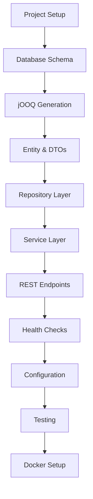

# Implementation Plan for Quarkus User Management API

## High Priority Tasks (Core Functionality)

### 1. **Project Setup & Dependencies**
- Initialize Quarkus project with required extensions:
  - `quarkus-rest` (REST endpoints)
  - `quarkus-rest-jackson` (JSON serialization)
  - `quarkus-jdbc-mysql` (MySQL driver)
  - `quarkus-flyway` (database migrations)
  - `quarkus-smallrye-health` (health checks)
  - jOOQ dependencies and Maven plugin
- Configure Maven build with jOOQ code generation

### 2. **Database Schema Design**
- Create single Flyway migration: `V1__Create_users_table.sql`
- Define `users` table with:
  - `id` (UUID, primary key)
  - `username` (VARCHAR, unique, not null)
  - `created_at` (TIMESTAMP, default current)

### 3. **jOOQ Code Generation**
- Configure jOOQ Maven plugin for MySQL
- Run code generation to create type-safe database classes
- Ensure generated classes are available for development

## Medium Priority Tasks (Business Logic)

### 4. **Data Layer Implementation**
- **User Record**: Java record for immutable user representation
- **CreateUserRequest DTO**: Request payload with validation annotations
- **UserResponse DTO**: Response payload for API consumers

### 5. **Repository Layer**
- **UserRepository**: jOOQ-based data access layer
  - `findById(UUID id)` method
  - `findByUsername(String username)` method  
  - `insert(String username)` method (generates UUID)
  - `existsByUsername(String username)` method

### 6. **Service Layer**
- **UserService**: Business logic implementation
  - `createUser(CreateUserRequest)` - validates uniqueness, generates UUID
  - `getUserById(UUID)` - retrieves user by ID
  - `getUserByUsername(String)` - retrieves user by username
  - Handle business exceptions (duplicate username, user not found)

### 7. **REST API Layer**
- **UserResource**: REST endpoints
  - `POST /api/users` - create user endpoint
  - `GET /api/users/{id}` - get user by ID endpoint
  - `GET /api/users?username={username}` - get user by username (optional)
  - Proper HTTP status codes and error handling

### 8. **Health Check Implementation**
- **DatabaseHealthCheck**: Custom health check
  - Test database connectivity with simple query
  - Return UP/DOWN status with connection details
  - Integrate with Quarkus health check framework

## Low Priority Tasks (Production Readiness)

### 9. **Configuration Management**
- **application.properties**: Environment-specific configurations
  - Development: MySQL Dev Services configuration
  - Test: H2 in-memory database with MySQL compatibility
  - Production: External database configuration
- Configure Flyway settings for each environment

### 10. **Testing Strategy**
- **Unit Tests**:
  - UserService with mocked repository
  - UserRepository with TestContainers MySQL
  - UserResource with REST Assured
- **Integration Tests**:
  - Full stack tests with real database
  - Health check endpoint validation
- **Native Tests**: Ensure native compilation compatibility

### 11. **Deployment Configuration**
- **Dockerfile**: Multi-stage build for native/JVM modes
- **docker-compose.yml**: Local development with MySQL
- **Kubernetes manifests**: Production deployment configuration

## Implementation Order & Dependencies

## Key Decision Points

1. **UUID Generation**: Server-side UUID generation vs client-provided
2. **Username Validation**: Length limits, character restrictions, case sensitivity
3. **Error Handling**: Global exception handler vs endpoint-specific handling
4. **Database Indexing**: Unique constraints and performance indexes
5. **API Versioning**: Future-proof API design considerations

## Success Criteria

- ✅ Health check endpoint returns database connectivity status
- ✅ POST `/api/users` creates user with generated UUID
- ✅ GET `/api/users/{id}` retrieves user by UUID
- ✅ Duplicate username prevention with proper error response
- ✅ Database schema managed through Flyway
- ✅ Type-safe database queries with jOOQ
- ✅ Comprehensive test coverage
- ✅ Native compilation compatibility

## Detailed Task Breakdown

### Phase 1: Foundation (High Priority)
1. **Maven Configuration**
   - Add required Quarkus extensions to pom.xml
   - Configure jOOQ Maven plugin with MySQL settings
   - Set up properties for jOOQ code generation

2. **Database Schema**
   - Create `src/main/resources/db/migration/V1__Create_users_table.sql`
   - Define users table with proper constraints and indexes
   - Ensure UUID compatibility with MySQL

3. **Code Generation Setup**
   - Configure jOOQ to generate from local MySQL instance
   - Set up Maven goals for database setup and code generation
   - Verify generated classes are properly structured

### Phase 2: Core Implementation (Medium Priority)
4. **Domain Model**
   - Create User record with proper validation
   - Design DTOs for request/response handling
   - Implement proper serialization annotations

5. **Data Access**
   - Implement UserRepository with jOOQ DSLContext
   - Add proper error handling for database operations
   - Implement efficient query patterns

6. **Business Logic**
   - Create UserService with transactional methods
   - Add username uniqueness validation
   - Implement proper exception handling

7. **REST Layer**
   - Implement UserResource with proper JAX-RS annotations
   - Add request validation and error responses
   - Configure proper HTTP status codes

8. **Health Monitoring**
   - Create custom DatabaseHealthCheck
   - Test database connectivity and response times
   - Integrate with Quarkus health check system

### Phase 3: Production Readiness (Low Priority)
9. **Environment Configuration**
   - Set up development, test, and production profiles
   - Configure database connections for each environment
   - Set up proper logging and monitoring

10. **Testing Implementation**
    - Write unit tests with Mockito
    - Create integration tests with TestContainers
    - Add performance and load testing

11. **Deployment Setup**
    - Create optimized Docker images
    - Set up local development environment
    - Prepare Kubernetes deployment manifests

This plan provides a structured approach to building the application incrementally, ensuring each layer is properly tested before moving to the next.