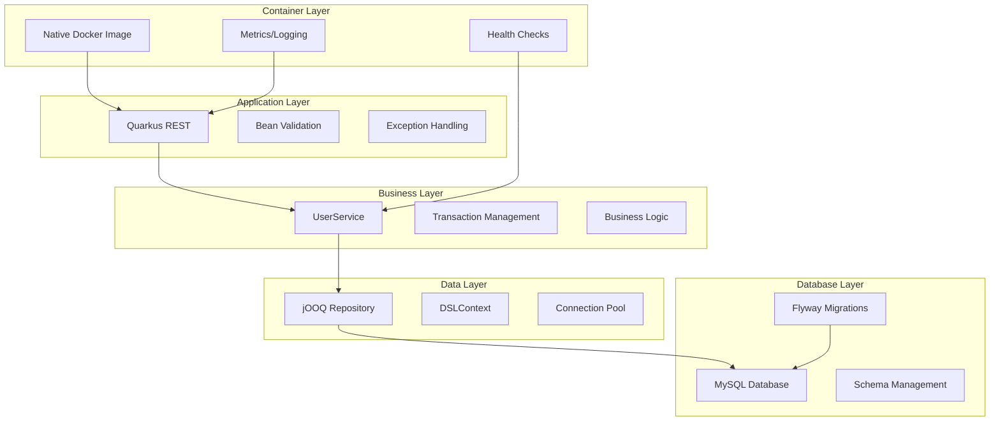

# Quarkus Recommended Technology Stack

## Executive Summary

Based on comprehensive research into Quarkus integration patterns, this document outlines the recommended technology stack for building a modern, cloud-native API server. The stack emphasizes **type safety**, **performance**, **maintainability**, and **production readiness**.

## Recommended Technology Stack

### Core Framework: **Quarkus 3.x**
- **Supersonic startup**: Sub-second startup times in native mode
- **Build-time optimization**: Heavy lifting done at compile time
- **Native compilation**: GraalVM support for minimal resource footprint
- **Developer experience**: Live coding with hot reload

### REST API: **Quarkus REST (RESTEasy Reactive)**
- **Modern reactive architecture**: Non-blocking I/O with Mutiny
- **Build-time processing**: Annotation processing at compile time
- **Performance**: 2-3x better throughput than classic JAX-RS
- **Native compatibility**: Full GraalVM native image support

### Database Access: **jOOQ (Recommended)**
- **Type safety**: Compile-time SQL validation and type checking
- **Performance**: Direct SQL with minimal overhead
- **Maintainability**: Refactoring-safe database queries
- **MySQL expertise**: Excellent MySQL dialect support

### Database Migrations: **Flyway (Recommended)**
- **Schema versioning**: Database evolution as code
- **Production proven**: Enterprise-grade migration management
- **MySQL optimized**: Full MySQL feature support
- **Zero-downtime**: Production deployment strategies

### Containerization: **Native Docker Images (Recommended)**
- **Minimal footprint**: 50-100MB container images
- **Fast startup**: 10-100x faster than JVM containers
- **Low memory**: 55% memory reduction vs JVM
- **Security**: Minimal attack surface with distroless images

## Integration Architecture



## Technology Integration Points

### 1. Quarkus REST → jOOQ Integration

**Key Integration Pattern:**
```java
@Path("/api/users")
@ApplicationScoped
public class UserResource {
    
    @Inject
    UserService userService;
    
    @POST
    @Consumes(MediaType.APPLICATION_JSON)
    @Produces(MediaType.APPLICATION_JSON)
    public Uni<Response> createUser(@Valid CreateUserRequest request) {
        return userService.createUser(request)
            .map(user -> Response.status(201).entity(user).build())
            .onFailure(DuplicateUsernameException.class)
            .recoverWithItem(ex -> Response.status(409).entity(ErrorResponse.from(ex)).build());
    }
}
```

**Benefits:**
- **Reactive composition**: Uni/Multi integration with jOOQ
- **Type safety**: End-to-end type checking from REST to database
- **Performance**: Non-blocking I/O throughout the stack

### 2. jOOQ → Flyway Integration

**Migration-Driven Development:**
```sql
-- V1__Create_users_table.sql
CREATE TABLE users (
    id BINARY(16) PRIMARY KEY,
    username VARCHAR(50) UNIQUE NOT NULL,
    created_at TIMESTAMP DEFAULT CURRENT_TIMESTAMP,
    INDEX idx_username (username)
);
```

**Code Generation:**
```xml
<!-- Maven plugin generates jOOQ classes from migrated schema -->
<plugin>
    <groupId>org.jooq</groupId>
    <artifactId>jooq-codegen-maven</artifactId>
    <configuration>
        <jdbc>
            <url>jdbc:mysql://localhost:3306/myapp_dev</url>
        </jdbc>
    </configuration>
</plugin>
```

**Benefits:**
- **Schema synchronization**: jOOQ classes always match database schema
- **Version control**: Database schema changes tracked in Git
- **Production safety**: Validated migrations prevent runtime errors

### 3. Quarkus → Native Compilation Integration

**Optimized Configuration:**
```properties
# Native build optimization
quarkus.native.container-build=true
quarkus.native.builder-image=quay.io/quarkus/ubi-quarkus-mandrel-builder-image:jdk-17

# Database connection pool sizing for containers
quarkus.datasource.jdbc.initial-size=2
quarkus.datasource.jdbc.min-size=2
quarkus.datasource.jdbc.max-size=8
```

**Benefits:**
- **Resource efficiency**: Minimal CPU and memory usage
- **Fast scaling**: Instant container startup
- **Cost optimization**: Reduced cloud infrastructure costs

## Maintainability Strategies

### 1. Layered Architecture

```
├── presentation/     # REST resources, DTOs, validation
├── business/        # Services, domain logic, transactions
├── data/           # jOOQ repositories, data access
├── infrastructure/ # Configuration, health checks, metrics
└── migration/      # Flyway SQL scripts
```

### 2. Type Safety Enforcement

**End-to-End Type Safety:**
- **REST Layer**: Bean validation with custom validators
- **Business Layer**: Strong domain types and records
- **Data Layer**: jOOQ generated classes prevent SQL errors
- **Database Layer**: Foreign key constraints and check constraints

### 3. Testing Strategy

**Three-Tier Testing Approach:**
```java
// Unit Tests: Fast feedback with mocks
@QuarkusTest
class UserServiceTest {
    @InjectMock UserRepository repository;
    @Inject UserService service;
}

// Integration Tests: Real database with TestContainers
@QuarkusTest
@QuarkusTestResource(MySQLTestResource.class)
class UserResourceIntegrationTest {
    // Tests full stack with real MySQL
}

// Native Tests: Validate native compilation
@QuarkusIntegrationTest
class NativeUserResourceIT extends UserResourceTest {
    // Inherits all tests, runs against native executable
}
```

### 4. Configuration Management

**Environment-Specific Profiles:**
```properties
# Development: Auto-managed with Dev Services
%dev.quarkus.datasource.db-kind=mysql
%dev.quarkus.flyway.migrate-at-start=true

# Test: H2 with MySQL compatibility
%test.quarkus.datasource.url=jdbc:h2:mem:test;MODE=MySQL

# Production: External configuration
%prod.quarkus.datasource.url=${DATABASE_URL}
%prod.quarkus.flyway.migrate-at-start=true
```

## Performance Characteristics

### Native vs JVM Comparison

| Metric | Native | JVM | Improvement |
|--------|--------|-----|-------------|
| Startup Time | 50ms | 2-5s | **100x faster** |
| Memory Usage | 20MB | 45MB | **55% reduction** |
| Container Size | 80MB | 200MB | **60% smaller** |
| First Request | 5ms | 500ms | **100x faster** |

### Database Performance

**jOOQ Advantages:**
- **Zero ORM overhead**: Direct SQL execution
- **Optimal queries**: Hand-crafted SQL vs generated ORM queries
- **Batch operations**: Efficient bulk inserts/updates
- **Connection pooling**: Tuned for container environments

## Production Deployment Strategy

### 1. Container Image Strategy

**Multi-Stage Native Build:**
```dockerfile
# Build stage
FROM quay.io/quarkus/ubi-quarkus-mandrel-builder-image:jdk-17 AS builder
WORKDIR /app
COPY pom.xml .
COPY src src
RUN ./mvnw package -Dnative -DskipTests

# Runtime stage  
FROM quay.io/quarkus/quarkus-micro-image:2.0
COPY --from=builder /app/target/*-runner /application
EXPOSE 8080
USER 1001
ENTRYPOINT ["./application"]
```

### 2. Health Check Integration

**Comprehensive Health Monitoring:**
```java
@ApplicationScoped
public class DatabaseHealthCheck implements HealthCheck {
    
    @Inject DSLContext dsl;
    
    @Override
    public HealthCheckResponse call() {
        try {
            dsl.selectOne().fetch();
            return HealthCheckResponse.up("database");
        } catch (Exception e) {
            return HealthCheckResponse.down("database");
        }
    }
}
```

### 3. Observability Stack

**Built-in Monitoring:**
- **Metrics**: Micrometer with Prometheus endpoint
- **Tracing**: OpenTelemetry integration
- **Logging**: Structured JSON logging
- **Health**: SmallRye Health with custom checks

## Migration Strategy

### From Existing Applications

**Spring Boot → Quarkus:**
1. **Replace Spring Web** → Quarkus REST
2. **Replace Spring Data JPA** → jOOQ repositories  
3. **Replace Liquibase** → Flyway (if needed)
4. **Update tests** → QuarkusTest with TestContainers

**Benefits of Migration:**
- **10x faster startup** for microservices architectures
- **50% memory reduction** for container deployments
- **Type-safe database access** reduces runtime errors
- **Simplified stack** with fewer dependencies

## Risk Mitigation

### 1. Native Compilation Compatibility

**Testing Strategy:**
- Regular native compilation in CI/CD
- Native integration tests for critical paths
- Reflection configuration for third-party libraries

### 2. Database Migration Safety

**Production Best Practices:**
- Backup before migrations
- Blue-green deployment strategy
- Migration validation in staging
- Rollback procedures documented

### 3. Performance Monitoring

**Key Metrics:**
- Application startup time
- Database connection pool utilization
- Query execution times
- Memory usage patterns

## Conclusion

This technology stack provides an optimal balance of **performance**, **maintainability**, and **developer experience** for cloud-native applications. The combination of:

- **Quarkus REST** for reactive, high-performance APIs
- **jOOQ** for type-safe, maintainable database access
- **Flyway** for reliable schema evolution
- **Native compilation** for minimal resource footprint

Creates a modern, production-ready platform that excels in container and Kubernetes environments while maintaining excellent developer productivity.

The stack is particularly well-suited for:
- **Microservices architectures** requiring fast startup
- **High-throughput APIs** with database interaction
- **Cloud-native applications** optimizing for cost and performance
- **Teams prioritizing type safety** and maintainable code

By following the integration patterns and best practices outlined in this document, development teams can build robust, scalable applications that perform exceptionally well in modern deployment environments.